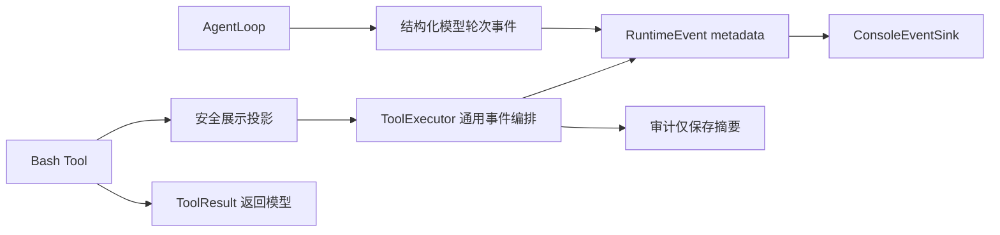

# 模型轮次、Bash 指令与执行结果可见性计划

## 目标与非目标

### 当前基线

上一轮“持久化 full-access、精简过程、script/data 目录”计划已经进入实现。本计划只处理新的 Bash 展示缺口，不重复规划或修改上一轮功能。
当前执行链已经产生工具事件和模型事件，但：

- 开始事件只携带工具名，用户看不到 Bash 实际提交的 command。
- Bash 结果正文只返回模型，CLI 终态只显示成功/失败和耗时。
- `BashTool.display_arguments()` 当前只提供 command hash，不满足人工观察需要。
- `AgentLoop` 已按任务产生模型轮次事件，但 CLI 将其全部过滤，运行中看不到当前轮次。

### 目标

- Bash 执行前展示即将执行的用户可读指令。
- Bash 结束后展示终态、退出码、耗时以及 stdout/stderr 结果预览。
- 每次模型调用开始时显示任务内当前轮次及上限，让用户看懂“模型→工具→模型”的推进过程。
- 保持默认过程简洁，不显示模型普通完成、安全检查通过等重复内部噪音。
- 复用通用 Tool 事件契约，不在 CLI 或 ToolExecutor 增加 Bash 名称分支。

### 非目标

- 不实现逐字节实时流式终端；结果在本次命令结束、失败、超时或取消后展示。
- 不展示模型思维链、响应正文、Token 统计或 Backend 内部重试次数。
- 不把完整 Bash 命令或输出写入 SQLite。
- 不改变 Bash 权限、审批、cwd、超时、取消、输出总预算或环境清理规则。
- 不要求 read/write/edit 等工具默认展示文件正文或 diff。
- 不重新设计上一轮已经实现的权限偏好和目录迁移。

配套用例图见 [`SVG`](./BASH_COMMAND_RESULT_VISIBILITY_USE_CASE.svg) 和 [`PNG`](./BASH_COMMAND_RESULT_VISIBILITY_USE_CASE.png)。

## 架构边界



必须保持三个投影彼此独立：

- 模型投影：受 `MAX_OUTPUT_BYTES` 限制的 ToolResult。
- 界面投影：用户可读、脱敏、终端安全且有独立长度上限的命令/结果预览。
- 审计投影：仅保存 hash、状态和安全摘要，不保存完整命令与输出。

## 功能契约

### 模型轮次展示

- 一轮严格定义为 `AgentLoop` 发起一次顶层模型调用；工具数量、消息数量和 Backend 内部重试均不增加轮次。
- 轮次按任务从 1 开始，模型调用前显示“第 N/max_turns 轮：处理中”（如 `[模型] 第 2/20 轮：处理中`），下一任务重新从 1 开始；颜色和标点不作强制要求。
- 每轮默认只显示开始行；正常的 `model_finished` 继续保留为内部事件，但不再输出一条重复的“模型成功”。
- `model_failed` 必须显示失败所在轮次和脱敏后的简短原因；不得展示模型响应正文或内部推理内容。
- 调用前取消不产生虚假下一轮；调用中取消可保留已开始的轮次；达到上限时最后可见轮次不得超过上限。
- 用户可见事件使用结构化 `turn_number`、`max_turns` 和状态字段，CLI 不解析中文 message 获取轮次。

### Bash 指令展示

- 在进程真正启动前显示指令；审批仍按原有模式发生，显示不能代替审批。
- 显示模型提交并通过校验的 command，而不是 command sha256。
- full-access/relaxed 的原始多行 Shell 保留换行和顺序，每行使用清晰缩进。
- strict 模式展示用户提交的命令；策略附加的保护参数不必制造大段 UI 噪音。
- 同时显示本次 timeout；默认值可以省略，非默认值必须可见。
- 命令超过界面预算时安全截断并显示“指令已截断”，不能静默省略后半段。

### Bash 结果展示

- 终态必须区分成功、失败、超时和取消并始终显示退出码；尚无有效退出码时显示明确的不可用状态，不能伪造为 0。
- 显示执行耗时和输出是否被截断。
- stdout 与 stderr 分区展示；只有其中一项时只展示该分区，两者都为空时明确显示“无输出”。
- 失败时在终态之后展示可用的 stderr/stdout，帮助用户定位具体失败点。
- 预览按 UTF-8 字节安全截断并带可见标记；完整受限结果仍返回模型。

### 通用扩展契约

- Tool 可以声明安全的调用展示和结果展示；默认实现不暴露参数值或结果正文。
- Bash 覆盖该能力，未来其他 Tool 可选择性加入，不需要修改 ToolExecutor 或 CLI 分支。
- ToolExecutor 只负责调用展示契约、补充规范工具名/状态/耗时并发出事件。
- RuntimeEvent metadata 必须已经安全，可由 CLI、Web UI 或未来 Channel 直接消费。
- CLI 只渲染结构化字段，不解析中文 message，也不读取 AgentLoop 或 Bash 的私有 metadata。

## 安全底线

- 命令和输出在进入界面事件前必须先移除或可见化 ANSI、退格、回车覆盖及危险控制字符，
  再执行敏感信息脱敏，最后进行 UTF-8 安全截断。
- 保留正常换行和必要制表语义，但任何内容都不能覆盖已输出的终端行或伪造新的过程前缀。
- API Key、Token、Cookie、密码、私钥、常见凭据形态和敏感环境变量值不得出现在界面。
- 模型失败原因同样先脱敏并限制长度，不得借轮次展示泄漏提示词或模型响应正文。
- full-access 不取消展示脱敏和终端安全处理。
- 展示失败必须隔离，不能把一个原本成功的 Bash 命令改成任务失败。
- 未知或第三方 Tool 使用保守默认展示，不能因新契约意外暴露任意正文。
- SQLite 审计契约保持不变：不得保存原始 Bash command 或完整 stdout/stderr。

## 非强制实施建议

以下仅是基于当前代码的职责级影响面估计：

- Tool 契约：为结果增加带保守默认值的展示投影，与现有 audit/model 投影分开。
- Bash 工具：生成脱敏命令预览和 stdout/stderr 结果预览。
- AgentLoop：在现有模型事件中提供任务内轮次和上限，不建立平行计数状态。
- Executor：把工具展示投影加入开始/终态事件，不按工具名称分支。
- Event/CLI：传递并渲染结构化的轮次、invocation、result、exit_code 和 truncated 字段。
- 测试：复用 RecordingSink、Fake Backend、真实 Git Bash 条件测试和 SQLite 哨兵扫描。

命令和结果应有独立的有限界面预算；默认结果预览可从约 4 KiB 起步。具体常量、类名和文件拆分由 Implementer 决定，不要求新增配置中心或通用日志框架。

## 验收与交接

必须覆盖：

1. 每次顶层模型调用前恰好显示一条任务内 `N/max_turns`，首轮为 1，新任务重新计数。
2. 同一轮的多个工具不增加模型轮次；工具完成后的下一次模型调用才递增。
3. 正常模型完成不产生重复成功行；模型失败显示正确轮次和脱敏后的有限原因。
4. 调用前取消、调用中取消和达到轮次上限均不产生越界或虚假轮次。
5. Bash 开始事件和默认 CLI 输出包含脱敏后的实际 command，不再只显示 hash。
6. 单行、多行、含引号和非 ASCII 指令保持可读，顺序不被改变。
7. 成功且有 stdout、只有 stderr、两者同时存在、成功无输出均正确展示。
8. 非零退出、超时和取消显示正确终态、退出码语义和可用结果预览。
9. 长命令、长输出、多字节字符和终端控制字符安全处理且带明确截断标记。
10. 命令、输出和模型错误中的凭据哨兵不进入 CLI、RuntimeEvent 或异常信息。
11. 原始命令和完整输出不进入 SQLite；既有审计关联与状态不回退。
12. 非 Bash Tool 和第三方测试 Tool 使用默认展示时不暴露正文。
13. `--no-progress` 同时关闭模型轮次和工具过程；事件接收器故障不改变任务结果。
14. 默认 CLI 仍不显示安全检查通过、模式自动允许、模型思维链或响应正文。

实现修改公共 Tool/Event/Executor/CLI 链路，完成后必须运行：

```powershell
.\.venv\Scripts\python.exe -m pytest -q -rs
.\.venv\Scripts\ruff.exe check .
.\.venv\Scripts\python.exe -m compileall -q src
git diff --check
```

Implementer 在 `docs/Implement/IMPLEMENTATION_NOTES.md` 记录轮次格式、展示预算、控制字符处理顺序和测试结果；Reviewer 重点扫描 CLI、RuntimeEvent、SQLite 和异常出口中的敏感哨兵，并给出 PASS 或 CHANGES_REQUIRED。

## 反锚定检查

- 本计划锁定展示结果与安全顺序，不强制类名、方法名或私有 metadata 字段名。
- ToolExecutor 与 CLI 不得因本需求新增 Bash 名称分支。
- UI、模型和审计三个投影保持独立，Implementer 仍可选择最简代码形态。
- 模型轮次复用现有 AgentLoop 计数语义，不引入新的生命周期抽象；计划不扩大到思维链、实时终端或所有 Tool 的正文展示。
