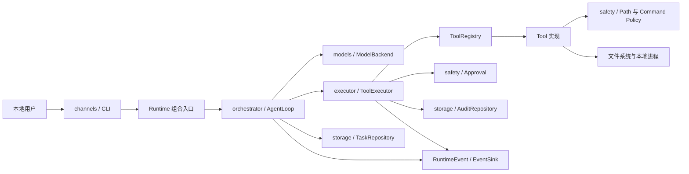

# 当前工程架构评估

## 评估范围与结论

本评估基于 2026-08-18 的当前工作树，包括尚未提交的过程展示、三档审查模式、
full-access 和工具扩展实现；不是只评估 `main` 基线。

结论：当前工程已经具备适合本地 CLI MVP 的清晰分层，工具扩展主干设计良好，
但还不能称为“整体强扩展架构”。更准确地说：

- 模块级内聚较好，类级内聚不均衡。
- 核心执行链路耦合可控，但公共契约和权限上下文存在跨层扩散。
- Tool 和 ModelBackend 扩展性较强。
- Channel、长期任务、存储演进和第三方插件扩展性仍处于早期阶段。
- 当前没有需要推倒重构的架构问题；应做小步职责收敛，避免为未来假设提前搭建复杂框架。

当前最新版 Reviewer 已给出 `PASS`，全量验证记录为 128 passed、2 skipped。
这说明现有行为和安全边界有较强回归保障，但 Reviewer 的 `PASS` 不等于所有架构债务已经消失。

定性评分如下。分数用于表达相对成熟度，不是验收门槛：

| 维度 | 评分 | 判断 |
|---|---:|---|
| 分层边界 | 7.5/10 | 主链路清晰，组合入口集中 |
| 高内聚 | 7/10 | 多数模块单一，但执行器和 Bash 偏重 |
| 低耦合 | 6.5/10 | 依赖注入良好，公共类型与权限模式跨层扩散 |
| Tool 扩展性 | 8/10 | 核心层不按工具名分支，已有显式注册点 |
| Model 扩展性 | 8/10 | 供应商协议被 Backend 接口隔离 |
| Channel 扩展性 | 4.5/10 | 只有 CLI，尚无渠道无关的任务应用入口 |
| 存储演进性 | 6/10 | Repository 清晰，迁移与跨记录一致性仍较轻量 |
| 测试与可诊断性 | 8.5/10 | Fake、审计、事件、安全和异常路径覆盖较完整 |

配套能力与优化用例图见
[`CURRENT_ARCHITECTURE_USE_CASE.svg`](./CURRENT_ARCHITECTURE_USE_CASE.svg)；
另提供 [`PNG 预览`](./CURRENT_ARCHITECTURE_USE_CASE.png)。

## 当前架构边界



这条主链路符合项目既定原则：渠道不直接运行 Shell，编排层不直接访问文件和进程，
安全检查位于实际执行之前，模型供应商对象不会越过 Backend 边界。

## 已经做得好的部分

### 1. 运行时组装集中

`runtime.build_runtime()` 是明确的组合入口，负责连接配置、模型、Registry、Executor、
审批和 Repository。CLI 只选择模式、展示事件并启动任务，没有自行拼接工具执行细节。

收益：

- 测试可以替换 Backend、审批器和事件接收器。
- CLI 不知道具体 Tool 类型。
- 未来替换模型供应商不需要修改 Agent Loop。

### 2. Tool 核心链路已经解除名称耦合

`ToolRegistry` 接收显式工具集合并动态返回规格；`ToolExecutor` 通过 Tool 契约调用校验、
安全检查、审批、执行和摘要能力，不再维护 `read/write/edit/bash` 名称分支。

新增一个不需要全局配置或特殊基础设施的工具，通常只需：

1. 在工具域实现 Tool 契约。
2. 在工具注册点显式加入实现。
3. 增加工具自身及通用执行链路测试。

核心的 Agent Loop、ToolExecutor 和模型 Backend 不应因此修改。当前测试中的 `EchoTool`
也验证了这一点。因此，用户最关心的“以后主要扩 Tool”目标已基本具备结构基础。

### 3. 模型供应商隔离清晰

`ModelBackend` 只暴露统一的异步 `complete()`，OpenAI 兼容协议转换位于具体 Backend 内。
Fake Backend 能直接驱动 Agent Loop 测试。这里具有较好的高内聚、低耦合特征。

### 4. 安全职责已拆成可理解的子域

路径解析、命令策略、审批、脱敏和审查模式位于 `safety`，没有全部堆进 Agent Loop。
严格模式的命令解析与 Bash 进程启动也已分离为 `CommandPolicy` 与 `BashTool`。

### 5. 过程展示使用观察者边界

Agent Loop 和 ToolExecutor 产生结构化事件，CLI 负责渲染；事件接收器故障不会改变任务结果。
因此未来增加日志、WebSocket 或远程进度推送时，可以复用事件源，而不必把打印逻辑写进工具。

### 6. 基础设施有 Repository 边界

任务和审计 SQL 没有散落到编排与 Tool 实现中。任务状态流转、工具审计和审批审计都有
独立入口，并且 SQLite 连接有自动提交与回滚上下文。

## 主要优化点

### 优先级 A：控制 ToolExecutor 的职责增长

`ToolExecutor` 当前约 500 行，同时承担：

- 工具查找与调用编排。
- 参数展示和审计投影。
- 安全检查与审批生命周期。
- 审计开始、结束和异常补偿。
- 事件生成。
- 模型结果、metadata、字节预算和截断格式化。
- full-access 任务级确认记录。

这些职责都与“执行一次工具”相关，所以不是无关逻辑堆积；但它们有不同的变化原因。
例如修改模型消息预算不应迫使维护者理解 SQLite 审计补偿，修改审计字段也不应影响结果截断。

建议实现：保留 ToolExecutor 作为唯一执行门面和顺序控制者，只把已经稳定、可独立测试的
“审计生命周期”和“模型结果投影/预算”职责收敛为内部协作者。具体类名和文件位置不应预先锁死。

不要拆散的安全顺序：

```text
查找 -> 校验 -> 安全检查 -> 审批 -> 执行 -> 脱敏结果 -> 审计终态
```

### 优先级 A：降低 BashTool 的多重变化原因

`BashTool` 当前约 480 行，既实现 Tool 业务契约，也负责：

- Bash 发现和运行时探测。
- 环境变量清理。
- 进程创建、并发排空 stdout/stderr。
- 超时、取消和进程树终止。
- 输出格式化与预算。
- 审批和审计摘要。

命令允许策略已经独立，这是正确方向。下一步建议把纯进程生命周期能力放在 Bash 工具域内的
辅助组件中，让 BashTool 更集中于“把安全决定转换成一次 ToolOutput”。先保持在工具域内，
只有第二个进程类工具真实出现时，再考虑提升为 executor 的共享能力。

### 优先级 A：收敛审查模式的跨层传播

`ReviewMode` 当前出现在 CLI、Runtime、Agent Loop、Registry、ToolExecutor、Tool、路径策略、
命令策略和 TaskRepository。多处一致性校验防止权限错配，安全上是必要的；但模式语义被多个层解释，
以后增加第四种模式时，容易形成修改散点。

建议让一个不可变的任务执行上下文或访问策略成为唯一语义来源：

- 渠道只选择并展示模式。
- safety 负责解释模式对应的访问能力。
- orchestrator 和 storage 只传递、记录模式，不自行复制权限规则。
- Tool 使用已构造好的能力对象，不通过字符串比较推断权限。

当前 `write` 和 `edit` 中使用 `review_mode.value != "strict"` 的方式应逐步改为明确能力判断，
避免枚举新增后被自动归入更宽权限。

### 优先级 B：明确公共契约的归属

`orchestrator.schemas` 实际上是 CLI、Model、Executor 和 Storage 共用的共享契约；
`executor.base` 又直接依赖 orchestrator 的 ToolSpec 和 safety 的 ApprovalRequest。
当前没有明显运行时循环依赖，但包级依赖方向并不完全单向。

建议暂不为了目录纯洁做大范围移动。出现以下任一触发条件时，再把稳定类型收敛到中立契约域：

- 接入第二个 Channel。
- 接入第二种持久化实现。
- Tool 作为独立包发布。
- 外部模块开始绕过 Runtime 直接导入多个内部层。

在触发前，移动 schemas 只会制造大量无业务价值的 import diff。

### 优先级 B：为未来 Channel 增加应用级门面

当前 CLI 直接创建 Runtime 并调用 `AgentLoop.run()`，对单机一次性任务足够；但飞书、微信需要：

- 接收任务后立即返回任务 ID。
- 异步查询状态、取消和恢复。
- 把运行事件发送给不同订阅者。
- 绑定渠道身份、权限和回复目标。

当真正开始第二个 Channel 时，建议新增渠道无关的任务应用门面，统一提供提交、查询、取消和订阅。
Channel 只做协议转换；它不应直接持有 ToolExecutor、Repository 或 BashTool。

### 优先级 B：补齐持久化的一致性与迁移策略

现有 Database 内联迁移适合当前三张表，但任务状态与工具审计分别使用独立连接；进程异常时，
任务 `running` 能恢复为失败，残留的 `tool_calls.running` 尚没有对称恢复。

建议在以下变化到来时升级：

- 新增第三次以上结构迁移时，引入明确的 schema version 和有序迁移。
- 开始支持长期后台任务时，同时恢复任务和未完成工具调用的终态。
- 需要“一次状态变化与审计记录不可分割”时，再引入轻量事务协调，不提前建立复杂 Unit of Work。

### 优先级 C：逐步强化事件契约

`RuntimeEvent.event_type` 和 metadata 目前是自由字符串与字典。当前事件数量有限，简单直接；
当 Web UI 或远程 Channel 依赖这些字段后，拼写变化会成为隐式破坏性变更。

届时可把稳定事件类型改为枚举，并为关键事件定义最小字段契约。不要现在为每条日志建立大型继承体系。

## “强扩展性”的准确边界

### 当前已较强

- 新增内置 Tool：较强。
- 新增兼容模型 Backend：较强。
- 增加新的事件接收器：较强。
- 替换审批交互实现：较强。

### 当前一般

- 新增带独立配置的 Tool：可能需要同步修改全局 Settings。
- 新增另一种数据库：Executor 仍直接依赖具体 AuditRepository。
- 增加新的审查模式：需要跨多层检查分支。

### 当前较弱或未实现

- 飞书、微信等第二 Channel。
- 进程外任务队列、并发调度和长期恢复。
- 第三方 Tool 包自动发现、版本兼容和隔离。
- session/memory/skills 的可插拔实现。

因此不应宣称项目已经具有“全局强扩展性”。合理表述是：

> 当前已形成稳定的 Tool/Model 扩展主干，足以继续增加本地工具；面向远程渠道、长期任务和
> 第三方插件的应用边界仍需在真实需求出现时补齐。

## 必须保持的架构底线

后续任何优化都必须保持：

- Tool 只能经统一执行门面调用，不能绕过安全、审批和审计。
- full-access 仍受操作系统用户权限、超时、取消、输出上限和脱敏约束。
- Channel 不得直接执行 Shell 或直接访问具体工具。
- 模型供应商协议不得泄漏到 Agent Loop 和 Tool。
- 新 Tool 不得要求核心层增加按工具名称判断的分支。
- 当前 Reviewer 已覆盖的正常、拒绝、失败、取消和敏感信息测试不得回退。

## 非强制实施路线

建议按真实变化压力执行，而不是一次性重构：

1. 下一次修改执行结果格式时，顺手收敛 ToolExecutor 的结果投影职责。
2. 下一次增加进程类 Tool 时，再提取 Bash 的进程运行辅助能力。
3. 下一次修改审查模式时，先建立单一访问能力上下文，再增加模式。
4. 接入飞书或微信前，建立渠道无关的任务应用门面。
5. 数据库迁移和后台恢复需求实际出现后，再升级持久化基础设施。

不建议当前立即引入：依赖注入框架、事件总线中间件、自动扫描全部 Python 模块、微服务拆分、
复杂 DDD 分层或通用插件市场协议。这些会增加理解和调试成本，暂时没有对应规模收益。

## 架构验收信号

后续可用以下结果判断优化是否有效：

- 新增普通 Tool 只改工具实现、工具域注册点和测试，核心执行链路不变。
- 新增或调整模式时，权限含义只在 safety 的单一策略来源中定义。
- ToolExecutor 继续保持唯一安全顺序入口，但审计格式和模型消息预算可以独立测试。
- 新 Channel 只依赖应用级任务接口和事件接口，不导入具体 Tool 或 SQLite Repository。
- 重启恢复后，不存在永久停留在 `running` 的任务或工具审计。
- 依赖方向保持可解释，没有为了消除 import 而创建只转发调用的空壳抽象。

## 反锚定检查

- 本评估锁定职责和行为边界，没有强制未来类名、文件名或私有数据结构。
- 即使 Implementer 调整文件拆分，上述安全顺序、扩展目标和验收信号仍然成立。
- 优化建议按需求触发，未要求一次性重构。
- 没有把行数本身当作拆分类的理由；依据是组件存在多个独立变化原因。
- 图示是当前能力与优化方向附件，不是强制目录结构。
