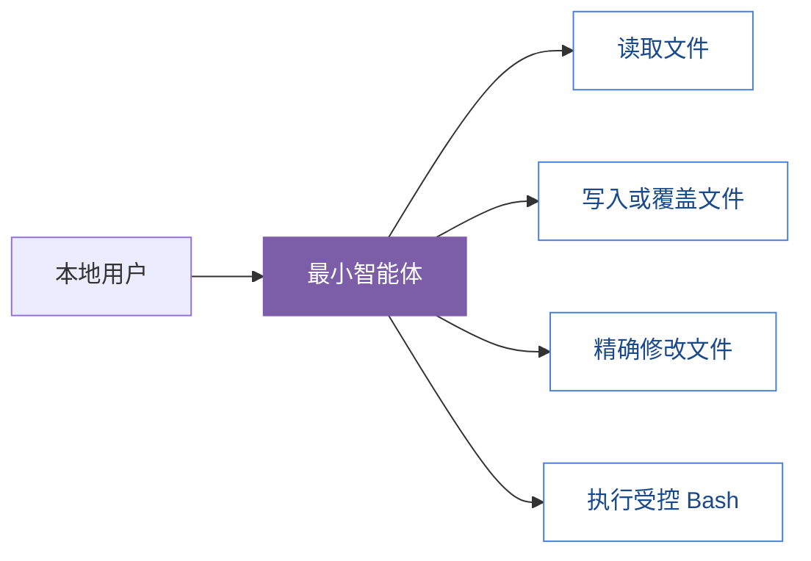
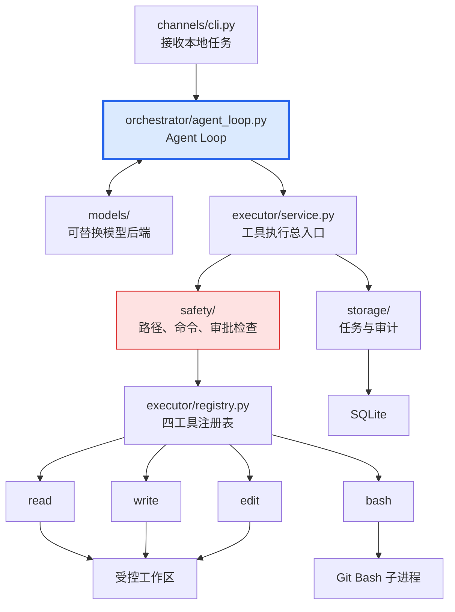
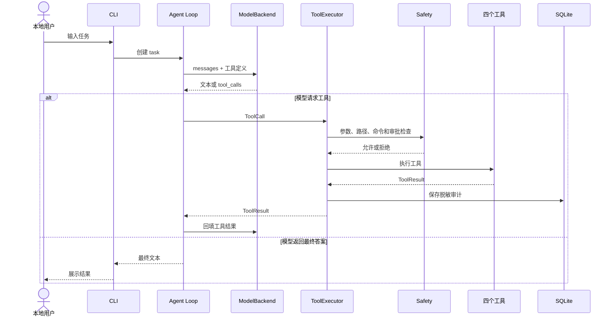

# 最小四工具智能体实现方案

> 创建标记：**本次创建**
>
> 创建日期：2026-08-17
>
> 创建角色：Planner
>
> 文档状态：DRAFT
>
> 写入范围约束：自本次创建起，Planner 只允许新增或修改 `docs/Planner/` 目录中的内容，不修改业务代码、其他文档或其他目录。

## 一、方案结论

第一阶段实现一个单进程、本地 CLI 驱动的最小智能体。模型默认只获得以下四个工具：

1. `read`：读取文件。
2. `write`：创建或完整覆盖文件。
3. `edit`：精确修改已有文件。
4. `bash`：执行受控 Bash 命令。

智能体核心采用与 Pi Agent 相似的循环：

```text
用户请求
→ 模型判断
→ 模型产生工具调用
→ 本地执行工具
→ 工具结果回填模型
→ 模型继续判断
→ 返回最终答案
```

本项目不能直接复制 Pi Agent 的默认权限模型。Pi 默认不提供文件系统、进程和网络权限隔离，而立凯中枢必须在工具执行前增加路径限制、命令策略、人工审批和审计记录。

参考资料：

- [Pi Coding Agent](https://github.com/earendil-works/pi/tree/main/packages/coding-agent)
- [Pi Agent Core](https://github.com/earendil-works/pi/tree/main/packages/agent)
- [Pi read 工具](https://github.com/earendil-works/pi/blob/main/packages/coding-agent/src/core/tools/read.ts)
- [Pi write 工具](https://github.com/earendil-works/pi/blob/main/packages/coding-agent/src/core/tools/write.ts)
- [Pi edit 工具](https://github.com/earendil-works/pi/blob/main/packages/coding-agent/src/core/tools/edit.ts)
- [Pi bash 工具](https://github.com/earendil-works/pi/blob/main/packages/coding-agent/src/core/tools/bash.ts)

## 二、本阶段范围

### 2.1 必须实现

- 本地 CLI 接收一次任务。
- 可替换的模型调用接口。
- 最小 Agent Loop。
- `read`、`write`、`edit`、`bash` 四个工具。
- 工作区路径限制。
- 写入、修改和 Bash 的人工审批。
- Bash 危险操作拦截、超时和输出限制。
- 任务状态和工具调用审计。
- 单元测试和最小集成测试。

### 2.2 本阶段不实现

- FastAPI 和 HTTP/Webhook。
- 飞书、微信等外部渠道。
- 多智能体和子智能体。
- 长期记忆、向量数据库和知识库。
- 技能市场和插件系统。
- 后台任务队列。
- 浏览器操作。
- 任意目录访问。
- 未经审批的任意 Bash。

## 三、业务用例



## 四、整体代码拓扑



依赖方向固定为：

```text
CLI
→ Agent Loop
→ ToolExecutor
→ Safety
→ 具体工具

ToolExecutor
→ Audit
→ SQLite
```

约束：

- CLI 只做参数接收、审批交互和结果展示。
- Agent Loop 不能直接读取文件或启动进程。
- 四个工具不能绕过 Safety。
- 模型调用只能通过 `ModelBackend`。
- 工具调用无论成功、失败或被拒绝，都必须留下审计记录。

## 五、建议目录结构

```text
Lak-Nexus/
├── pyproject.toml
├── src/
│   └── likai_nexus/
│       ├── __init__.py
│       ├── config.py
│       ├── errors.py
│       │
│       ├── channels/
│       │   └── cli.py
│       │
│       ├── orchestrator/
│       │   ├── agent_loop.py
│       │   └── schemas.py
│       │
│       ├── models/
│       │   ├── base.py
│       │   └── openai_backend.py
│       │
│       ├── executor/
│       │   ├── base.py
│       │   ├── registry.py
│       │   ├── service.py
│       │   └── tools/
│       │       ├── read_file.py
│       │       ├── write_file.py
│       │       ├── edit_file.py
│       │       └── bash.py
│       │
│       ├── safety/
│       │   ├── paths.py
│       │   ├── command_policy.py
│       │   └── approval.py
│       │
│       └── storage/
│           ├── database.py
│           ├── task_repository.py
│           └── audit_repository.py
│
└── tests/
    ├── unit/
    │   ├── safety/
    │   ├── executor/
    │   └── orchestrator/
    └── integration/
        └── test_cli_agent.py
```

### 5.1 核心文件职责

| 文件 | 职责 | 禁止承担的职责 |
|---|---|---|
| `channels/cli.py` | 接收任务、显示工具调用、请求审批、显示结果 | 不执行工具，不包含模型协议 |
| `orchestrator/agent_loop.py` | 驱动模型和工具之间的循环 | 不直接访问文件、进程和数据库 |
| `orchestrator/schemas.py` | 定义消息、工具调用、任务状态等数据结构 | 不包含执行逻辑 |
| `models/base.py` | 定义可替换的模型接口 | 不绑定具体模型名称 |
| `models/openai_backend.py` | 将统一消息转换为具体模型请求 | 不执行业务工具 |
| `executor/service.py` | 统一编排工具查找、安全检查、执行和审计 | 不实现某个具体工具细节 |
| `executor/registry.py` | 注册和查找四个工具 | 不处理审批或持久化 |
| `executor/tools/*.py` | 实现具体文件或 Bash 操作 | 不自行决定权限 |
| `safety/paths.py` | 保证路径位于工作区 | 不读取或修改业务文件内容 |
| `safety/command_policy.py` | 判断 Bash 是否允许、拒绝或需要审批 | 不启动 Bash 进程 |
| `safety/approval.py` | 抽象人工审批 | 不包含命令判断规则 |
| `storage/*.py` | 保存任务、工具调用和审批记录 | 不参与任务决策 |

## 六、公共数据契约

在 `orchestrator/schemas.py` 中定义最小、明确的数据结构，避免在多层之间传递无约束字典。

### 6.1 ChatMessage

- `role`：`system`、`user`、`assistant` 或 `tool`。
- `content`：消息文本。
- `tool_call_id`：工具结果对应的调用 ID，可选。

### 6.2 ToolSpec

- `name`：工具名。
- `description`：给模型看的工具说明。
- `input_schema`：JSON Schema 参数定义。

### 6.3 ToolCall

- `id`：本次调用的唯一 ID。
- `name`：工具名。
- `arguments`：结构化参数。

### 6.4 ToolResult

- `tool_call_id`：对应调用 ID。
- `content`：供模型继续判断的文本结果。
- `is_error`：是否执行失败。
- `metadata`：退出码、截断信息、diff 摘要等非敏感信息。

### 6.5 AssistantTurn

- `content`：模型文本内容。
- `tool_calls`：模型要求执行的工具列表。

### 6.6 TaskStatus

首版状态固定为：

```text
pending
→ running
→ success | failed | cancelled
```

## 七、四个工具契约

| 工具 | 输入 | 核心行为 | 强制限制 |
|---|---|---|---|
| `read` | `path`，可选 `offset`、`limit` | 读取 UTF-8 文本 | 工作区内；限制行数和字节数 |
| `write` | `path`、`content` | 创建或完整覆盖文件 | 工作区内；每次审批；原子写入 |
| `edit` | `path`、`old_text`、`new_text` | 精确替换唯一文本 | 工作区内；每次审批；零次或多次匹配均失败 |
| `bash` | `command`，可选 `timeout_seconds` | 在工作区执行 Git Bash | 每次审批；命令策略；超时；输出截断 |

### 7.1 read

首版规则：

- 相对路径以 `WORKSPACE_ROOT` 为基准。
- 默认读取前 2,000 行，且最多返回 64 KiB。
- 支持通过 `offset` 和 `limit` 继续读取大文件。
- 截断时返回下一次读取位置。
- 二进制文件和无法解码的文本返回受控错误。
- 审计日志不保存完整文件内容。

### 7.2 write

首版规则：

- 支持创建新文件和完整覆盖旧文件。
- 审批信息必须标明“新建”或“覆盖”。
- 自动创建工作区内的父目录。
- 使用同目录临时文件和 `os.replace()` 完成原子写入。
- 写入失败时不能留下半个目标文件。
- 返回写入字节数和相对路径，不返回敏感内容。

### 7.3 edit

首版使用单个精确替换：

- `old_text` 必须在原文件中恰好出现一次。
- 出现零次时返回“未找到匹配文本”。
- 出现多次时返回“匹配不唯一”。
- 不做模糊匹配，避免修改错误位置。
- 保留原文件换行符和 BOM。
- 成功时返回 unified diff 和修改摘要。
- 后续确有需求时，再扩展为 Pi 风格的 `edits[]` 多块替换。

### 7.4 bash

Windows 环境下通过可配置的 Git Bash 执行：

```text
bash.exe -lc "<command>"
```

首版必须具备：

- 固定 `cwd=WORKSPACE_ROOT`。
- 默认超时 30 秒，最大超时通过配置限制。
- 超时或取消后终止整个进程树。
- 捕获退出码、stdout 和 stderr。
- 输出最多返回 64 KiB，超出部分标记为截断。
- 不允许交互式 stdin。
- 从子进程环境中移除密钥、Token 和 Cookie 类变量。
- 网络默认关闭；明显网络命令必须拒绝。
- 每次执行前必须获得人工审批。

## 八、安全设计

### 8.1 路径限制

所有文件工具共用一个 `resolve_workspace_path()`：

1. 读取配置的工作区根目录并解析为真实绝对路径。
2. 将工具输入转换为候选绝对路径。
3. 解析 `..`、符号链接和已有父目录。
4. 使用公共路径判断候选路径仍位于工作区内。
5. 工作区外路径直接拒绝，不进入具体工具。

需要特别测试：

- `../outside.txt`。
- 工作区外绝对路径。
- 工作区内指向外部目录的符号链接。
- 目标文件不存在但父目录包含符号链接。

### 8.2 审批策略

| 操作 | 默认行为 |
|---|---|
| 工作区内读取 | 允许并记录审计 |
| 新建文件 | 请求审批 |
| 覆盖文件 | 请求审批，并明确显示覆盖 |
| 修改文件 | 请求审批，并显示 diff 摘要 |
| Bash | 每次请求审批 |
| 工作区外操作 | 直接拒绝，不提供审批绕过 |

### 8.3 Bash 限制

仅将当前目录设为工作区，不能阻止 Bash 访问工作区外文件，也不能真正阻止网络访问。

在没有 Docker 或其他 OS 级沙箱时，首版采用严格模式：

- 禁止 `;`、`&&`、`||`、管道、重定向、反引号、`$()` 和多行命令。
- 使用 `shlex` 做最小参数解析。
- 仅允许经过确认的命令和参数形态。
- 拒绝删除、权限修改、安装、部署、网络访问和系统配置命令。
- 即使进入允许列表，`pytest` 等会执行项目代码的命令仍必须人工审批。

建议初始允许范围：

- `pwd`
- 受限的 `ls`
- 受限的 `rg`
- `git status`
- `git diff`
- `pytest`
- `ruff check`
- `python -m compileall`

残余风险：测试命令本身可以执行项目代码。远程渠道接入前，必须重新评估 Docker、Windows 沙箱或其他进程隔离方案。

### 8.4 敏感信息

- 不记录模型 API Key。
- 不记录完整环境变量。
- 不将 `.env` 内容写入审计日志。
- 工具参数入库前必须脱敏。
- Bash 输出入库时只保存脱敏摘要，完整输出默认不持久化。
- 模型异常不得把请求头、认证信息或底层 SDK 对象直接返回 CLI。

## 九、Agent Loop



Agent Loop 的最小逻辑：

1. 将用户消息加入上下文。
2. 将消息和四个 `ToolSpec` 发送给 `ModelBackend`。
3. 模型没有返回工具调用时，结束任务并返回文本。
4. 模型返回工具调用时，按照返回顺序串行执行。
5. 将每个工具的成功或失败结果作为 `tool` 消息加入上下文。
6. 再次调用模型。
7. 达到最大轮数、任务被取消或模型不可恢复失败时结束。

首版约束：

- 工具串行执行，不并发写文件。
- 默认最多 20 轮模型交互。
- 未知工具转换为 `is_error=True` 的工具结果。
- 参数错误、审批拒绝和普通工具异常回填模型，让模型有机会调整。
- 数据库不可用、配置无效等系统级错误终止任务。
- 任务取消必须向模型调用和 Bash 子进程传播。

## 十、工具执行总入口

`executor/service.py` 是唯一允许执行工具的入口，顺序不能改变：

```text
查找工具
→ 校验参数
→ Safety 检查
→ 必要时人工审批
→ 标记工具调用开始
→ 执行具体工具
→ 保存成功或失败审计
→ 返回 ToolResult
```

普通工具抛出的异常统一转换为工具失败结果，禁止吞异常后返回成功或空内容。

## 十一、模型抽象

`ModelBackend` 至少提供一个异步完成接口，输入为：

- 当前消息列表。
- 当前可用工具定义。
- 取消信号或超时上下文。

输出统一为 `AssistantTurn`，不让 OpenAI、Anthropic 或其他供应商的数据类型进入 Orchestrator。

测试时使用 `FakeModelBackend`，覆盖：

- 直接返回最终文本。
- 返回一次工具调用后再返回最终文本。
- 连续调用多个工具。
- 返回未知工具。
- 模型调用失败。
- 模型持续调用工具直到超过最大轮数。

## 十二、SQLite 设计

首版使用 Python 标准库 `sqlite3`，不引入 ORM。

### 12.1 tasks

建议字段：

- `task_id`
- `request_text`
- `status`
- `created_at`
- `started_at`
- `finished_at`
- `result_summary`
- `error_type`
- `error_message`

### 12.2 tool_calls

建议字段：

- `tool_call_id`
- `task_id`
- `tool_name`
- `arguments_redacted`
- `status`
- `started_at`
- `finished_at`
- `result_summary`
- `error_type`
- `error_message`

### 12.3 approvals

建议字段：

- `approval_id`
- `task_id`
- `tool_call_id`
- `action_type`
- `request_summary`
- `decision`
- `decided_at`

持久化规则：

- 数据库写入必须使用参数化 SQL。
- 任务状态更新和对应审计尽量在同一事务完成。
- 重复 `task_id` 不得创建第二个任务。
- 程序启动时将遗留的 `running` 任务恢复为可诊断的中断状态，或按最终设计恢复执行。

## 十三、分步骤实施计划

### 步骤 1：建立 Python 工程骨架

实施内容：

- 创建 `pyproject.toml`。
- 创建 `src/likai_nexus/` 和 `tests/`。
- 配置 Python 3.12、pytest 和 ruff。
- 添加最小导入测试。

验证：

```text
pytest
ruff check .
python -m compileall src
```

### 步骤 2：定义配置、错误和公共数据结构

实施内容：

- 加载 `WORKSPACE_ROOT`、数据库路径、Bash 路径和超时配置。
- 定义统一错误类型。
- 定义消息、工具、结果和任务状态结构。
- 定义 `ModelBackend` 和工具协议。

验证：

- 配置缺失时失败信息清晰。
- 公共结构具备类型标注。
- Fake Backend 可以被 Agent Loop 使用。

### 步骤 3：实现安全底座

实施内容：

- 实现统一工作区路径解析。
- 实现命令分类和拒绝规则。
- 定义审批接口和 CLI 审批实现。
- 为路径逃逸和审批拒绝补测试。

该步骤完成前，不实现任何实际写入和 Bash 执行。

### 步骤 4：实现 read

实施内容：

- 实现文本读取、分页和输出截断。
- 处理不存在、目录、二进制和编码错误。
- 保证工作区外路径被拒绝。

验收场景：

```text
读取 README.md
→ 返回文本内容
→ 大文件提示下一次 offset
```

### 步骤 5：实现 write 和 edit

实施内容：

- 实现原子写入。
- 区分新建和覆盖审批。
- 实现唯一精确替换。
- 返回 diff 摘要。
- 覆盖审批拒绝、写入失败和匹配异常测试。

### 步骤 6：实现 bash

实施内容：

- 检测或读取配置的 Git Bash 路径。
- 使用非交互子进程执行命令。
- 固定工作目录。
- 实现允许列表、拒绝规则、审批、超时、取消和输出截断。
- 处理 Bash 不存在、非零退出码和子进程终止失败。

### 步骤 7：实现 ToolRegistry 和 ToolExecutor

实施内容：

- 注册四个工具。
- 统一参数校验、安全检查、审批、执行和审计。
- 未知工具和工具异常转换为标准结果。
- 首版所有工具调用串行执行。

### 步骤 8：实现 Agent Loop

实施内容：

- 使用 Fake Backend 跑通工具调用循环。
- 加入最大轮数和取消控制。
- 将工具错误回填模型。
- 处理模型调用失败。

### 步骤 9：接入真实模型后端

实施内容：

- 将统一消息和工具定义转换为供应商请求。
- 将供应商响应转换为 `AssistantTurn`。
- 不在日志中输出 API Key、请求头和完整模型原始响应。

### 步骤 10：实现 CLI

实施内容：

- 接收用户任务。
- 创建任务记录。
- 显示模型文本和工具调用摘要。
- 对写入、修改和 Bash 请求人工确认。
- 支持 Ctrl+C 取消。
- 返回明确退出码。

### 步骤 11：实现 SQLite 审计和状态恢复

实施内容：

- 创建三张最小表。
- 保存任务状态、工具调用和审批。
- 对敏感参数和输出做脱敏。
- 处理程序中断后的 `running` 任务。

### 步骤 12：集成验证和 Reviewer 交接

实施内容：

- 跑通“读取 README 并总结”。
- 跑通“创建文件后修改文件”。
- 跑通“执行 pytest 并总结结果”。
- 验证工作区外路径和危险命令被拒绝。
- 执行完整测试、lint 和编译检查。
- 将 diff、测试结果和已知限制交给 Reviewer。

## 十四、测试矩阵

### 14.1 read

- 正常读取。
- 文件不存在。
- 输入为目录。
- 工作区外路径。
- 符号链接逃逸。
- 大文件分页和截断。
- 二进制文件。
- 非 UTF-8 文本。

### 14.2 write

- 创建新文件。
- 创建父目录。
- 覆盖已有文件。
- 用户拒绝审批。
- 工作区外路径。
- 写入异常后目标文件保持完整。
- 敏感内容不进入日志。

### 14.3 edit

- 唯一匹配并成功修改。
- 没有匹配。
- 多处匹配。
- 空字符串输入。
- 保留 CRLF/LF。
- 保留 BOM。
- 用户拒绝审批。
- 返回 diff 正确。

### 14.4 bash

- 允许命令成功执行。
- 非零退出码。
- 命令超时。
- 用户取消。
- 用户拒绝审批。
- 危险命令被拒绝。
- 网络命令被拒绝。
- Shell 元字符被拒绝。
- stdout/stderr 捕获。
- 大输出截断。
- 工作目录固定。
- 子进程环境不包含密钥。

### 14.5 Agent Loop

- 模型直接返回答案。
- 单次工具调用后返回答案。
- 连续多个工具调用。
- 未知工具。
- 参数校验失败。
- 工具执行失败后模型重试。
- 模型调用失败。
- 超过最大轮数。
- 任务取消。
- 重复任务幂等。

### 14.6 存储和日志

- 正常任务状态流转。
- 失败任务保存错误信息。
- 审批决定可追溯。
- 重启后遗留任务可诊断。
- API Key、Token、Cookie 和密码不出现在日志或数据库中。

## 十五、验收标准

本方案只有同时满足以下条件才可以交给 Reviewer：

1. CLI 能够驱动模型调用四个工具。
2. Agent Loop 不直接执行文件或进程操作。
3. 所有工具调用经过统一 ToolExecutor。
4. 所有文件操作限制在配置的工作区内。
5. 写入、修改和 Bash 都经过人工审批。
6. `edit` 不会在匹配不唯一时修改文件。
7. Bash 具备命令策略、超时、取消和输出限制。
8. 每次工具调用都有脱敏审计。
9. 模型调用失败、工具失败和任务取消都有明确状态。
10. `pytest`、`ruff check .` 和 `python -m compileall src` 全部通过。
11. Git diff 只包含计划范围内的文件。
12. Reviewer 最终给出 `PASS`。

## 十六、已知风险和后续决策

### 16.1 Bash 不是沙箱

命令允许列表和字符串检查只能降低风险，不能代替 OS 级隔离。接入飞书或微信前必须决定是否采用 Docker、Windows Sandbox 或独立低权限账户。

### 16.2 网络禁用无法仅靠环境变量保证

移除代理和凭据不能阻止进程建立网络连接。`ALLOW_NETWORK_ACCESS=false` 若要成为强保证，需要防火墙、容器网络或其他系统级控制。

### 16.3 原子写入仍存在竞态

路径检查和实际写入之间存在时间窗口。首版本地单用户、工具串行执行时风险可控；多用户或远程执行前需要进一步强化。

### 16.4 模型供应商尚未最终确定

实施时必须保持 `ModelBackend` 可替换，不能让供应商类型和模型名称散落在业务层。

## 十七、Planner 后续工作范围

从本次文档创建开始，Planner 后续只在以下目录内工作：

```text
docs/Planner/
```

允许的工作：

- 修改本方案。
- 新增阶段计划、风险分析、接口草案和测试计划。
- 记录 Planner 对 Implementer 的交接说明。

禁止的工作：

- 修改 `src/`、`tests/` 或任何业务代码。
- 修改 `docs/PLAN.md`、`docs/DECISIONS.md`、`docs/Review/` 中的审查产物。
- 修改项目配置、环境文件或脚本。
- 在 `docs/Planner/` 以外创建或修改文件。
