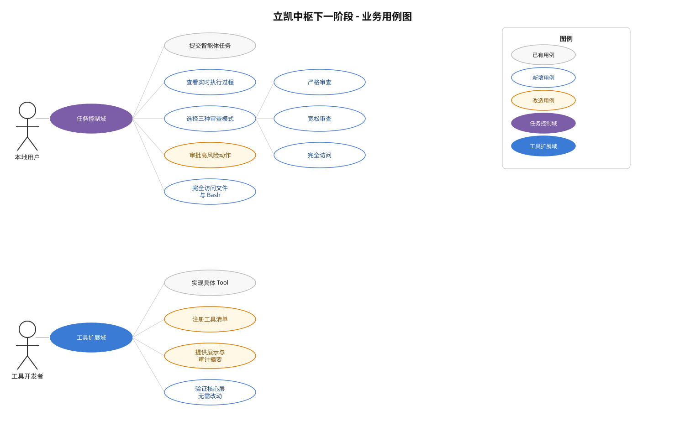
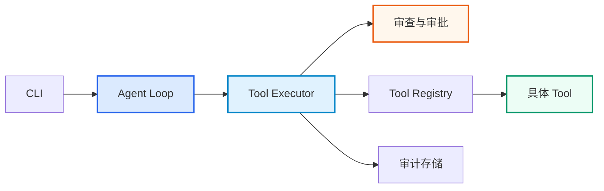

# 下一阶段计划：过程可观测、分级审查与工具扩展

> 更新日期：2026-08-18
>
> 角色：Planner
>
> 状态：PROPOSED
>
> 基线：本地四工具 CLI MVP，第六轮 Review 已 PASS

## 一、目标与非目标

### 本阶段目标

在不推翻现有执行主干的前提下完成三项能力：

1. 智能体运行时展示模型轮次、工具调用、审批和执行结果。
2. 用户可选择严格审查、宽松审查或完全访问。
3. 后续新增工具主要修改 Tool 范围，不反复修改 Agent Loop、执行器和 CLI。

### 本阶段非目标

- 不追求一次实现 Pi 的完整 TUI、会话树、消息 steering、扩展包生态和多模型管理。
- 不接入飞书、微信或 HTTP。
- 不实现多智能体、后台任务队列和长期记忆。
- 不把完全访问包装成沙箱或安全模式。

业务用例见：



## 二、保留的架构边界

以下主干继续保留：



必须保持的边界：

- CLI 负责参数、确认和展示，不直接执行文件或进程操作。
- Agent Loop 只负责编排模型与工具，不识别具体工具实现。
- Tool Executor 仍是安全检查、审批、执行和审计的统一入口。
- Tool Registry 动态提供本次可用工具，不写死四个工具名称。
- 工具不能绕过执行器直接对外执行。
- 模型调用继续通过可替换 Backend。

现有结构方向正确。本阶段是补全扩展点，而不是重建框架。

## 三、功能契约

### 3.1 实时过程展示

CLI 默认展示：

- 任务开始、任务 ID 和当前审查模式。
- 每轮模型调用开始、结束和工具调用数量。
- 工具名称及其脱敏参数摘要。
- 安全检查、人工审批或模式自动允许结果。
- 工具开始、成功、失败、拒绝、取消、耗时和安全结果摘要。
- 任务最终状态和总轮数。

不得展示：

- 模型隐藏推理或内部思维链。
- API Key、Token、Cookie、密码和完整环境变量。
- 未经工具安全摘要处理的原始参数。
- 为了展示而额外持久化完整文件正文、完整 diff 或完整 Bash 输出。

实现应使用结构化事件或等价机制，避免从日志文本反向解析状态。具体接口、类名和文件位置由 Implementer 根据现有代码决定。

展示故障不得把原本成功的任务改为失败；审计故障继续按现有规则终止任务。

### 3.2 三种审查模式

模式值建议使用 `strict`、`relaxed`、`full-access`，其中 `strict` 必须为默认值。

| 行为 | strict 严格审查 | relaxed 宽松审查 | full-access 完全访问 |
|---|---|---|---|
| 工作区内 read | 自动允许 | 自动允许 | 自动允许 |
| 工作区内 write/edit | 每次审批 | 自动允许并审计 | 自动允许并审计 |
| 工作区外 read/write/edit | 拒绝 | 拒绝 | 允许访问当前用户有权限操作的路径 |
| `.env`、凭据和私钥等敏感路径 | 拒绝 | 拒绝 | 允许操作，但展示和审计仍须脱敏 |
| Bash 命令语义 | 当前允许列表与安全 argv | 原始 Shell 脚本 | 原始 Shell 脚本 |
| 管道、重定向、多命令、变量、未知程序 | 拒绝 | 审批后允许 | 允许 |
| 网络、安装、删除、Git push | 拒绝 | 审批后允许 | 允许 |
| 每次 Bash 审批 | 是 | 是 | 否 |
| 任务开始提示 | 普通提示 | 风险提示 | 必须进行一次强确认 |

模式按任务固定，任务执行中不能静默提权或切换。

任务和审批审计必须能够追溯：

- 任务选择了哪种模式。
- 操作是人工批准、人工拒绝还是由模式自动允许。
- 工具最终是成功、失败、拒绝还是取消。

旧数据库必须能够增量迁移，旧记录默认按严格模式解释，不能删除或覆盖已有审计数据。

## 四、完全访问的准确边界

完全访问同时解除文件工具的工作区边界和 Bash 命令允许列表。文件工具与 Bash 都可以操作当前操作系统用户有权限访问的目标。

应支持：

- `read/write/edit` 使用绝对路径、`..`、用户目录或其他工作区外路径。
- `read/write/edit` 操作当前用户可访问的敏感文件；操作结果、过程展示和审计记录仍必须脱敏。
- Shell 内建命令、变量、通配符、管道和重定向。
- 多语句、子命令和脚本调用。
- 当前用户能够启动的本地程序。
- 当前用户权限允许的工作区外路径和网络访问。
- 显式调用 PowerShell、cmd 或其他已安装解释器。

仍然保留：

- 路径规范化和目标存在性、文件类型等操作合法性校验，但不得因为目标位于工作区外而拒绝。
- 文件操作目标、动作和结果的脱敏审计，不持久化完整文件正文。
- 非交互式 stdin。
- 超时与配置上限。
- 任务取消和进程树终止。
- stdout/stderr 输出上限与脱敏。
- 不加载 Bash profile/rc。
- 敏感环境变量清理。
- 完整工具调用审计。

完全访问不保证：

- 获得管理员、SYSTEM 或其他用户权限。
- 运行需要完整 TTY、密码交互或桌面 UI 的程序。
- 绕过操作系统 ACL、防病毒、防火墙和 UAC。
- 运行未安装或无法从当前环境找到的程序。

这里是安全底线：完全访问等价于把当前操作系统用户可用的文件系统和命令执行权限交给模型。它可以读取或修改工作区之外的个人文件、配置和凭据，也可以通过 Bash 删除或上传数据。初版只允许本地 CLI 选择；远程渠道在完成身份认证、权限绑定和 OS 级隔离前不得开放该模式。

## 五、工具扩展契约

当前 Registry 和 Tool 协议可以保留，但以下硬编码必须消除：

- 系统提示和未知工具错误写死 read、write、edit、bash。
- Registry 写死工具构造、返回顺序和 Bash 特殊检查。
- Tool Executor 按工具名分支生成展示、审计和结果摘要。
- 新工具为了增加安全 metadata 而修改执行器中央白名单。

改造后的结果契约：

1. Registry 从显式工具集合生成名称、规格和运行时检查。
2. 工具特有的参数展示、审计投影、模型可见状态和结果摘要，由 Tool 或与 Tool 同目录的注册描述提供。
3. Tool Executor 只处理通用执行顺序，不出现内置工具名称分支。
4. Agent Loop 只使用 Registry 提供的动态工具规格。
5. 新工具未声明安全摘要时使用保守默认值，不直接输出原始参数。
6. 重复工具名在启动阶段明确失败。
7. 文件访问策略必须使用任务审查模式：严格和宽松模式限制在工作区，完全访问模式允许当前用户权限范围内的工作区外路径。

建议使用显式工具目录或允许列表注册。不得因为某个文件被放入目录就自动向模型开放未经审核的可执行代码。

未来新增一个普通工具时，目标工作量是：

- 新增工具实现。
- 在 Tool 范围内显式注册。
- 增加该工具的单元测试。

不应修改 Agent Loop、Tool Executor、CLI 或存储层中的工具名分支。

是否引入基类、扩展 Protocol、使用描述对象或组合辅助函数，由 Implementer 根据代码复杂度选择；Planner 不指定具体类名。

## 六、Bash 改造约束

严格模式和原始 Shell 模式的命令准备逻辑必须分离，但进程生命周期应复用同一套实现。

严格模式继续保持当前行为：

- 拒绝 Shell 组合语法、网络、危险 Git 和未知命令。
- 只执行安全检查后得到的 argv。
- 保持现有严格模式测试语义。

宽松和完全访问共享原始 Shell 执行能力：

- 仅做输入合法性、超时和执行环境准备等通用校验。
- 保留原始脚本语义，不转换为当前允许列表 argv。
- 宽松模式在执行前逐次审批。
- 完全访问模式通过任务开始确认后不再逐次审批。

进程执行部分继续统一处理 Bash 发现、工作目录、环境清理、输出读取、退出码、超时、取消和进程树终止，避免复制三份 BashTool。

## 七、非强制实施建议

本节只说明影响面和推荐顺序，不是文件、类或方法清单。

> Implementer 必须先阅读现有调用链和 git diff。可以合并、拆分、重命名或调整实现位置，只要满足本文的行为契约、安全底线和验收标准。与建议不同的选择记录到 `docs/Implement/IMPLEMENTATION_NOTES.md`。

可能受影响的模块：

- CLI 与运行时组装：模式选择、完全访问确认、过程渲染。
- Orchestrator：任务和模型轮次事件。
- Executor：通用工具钩子、动态 Registry 和事件通知。
- Safety：模式决策、模式化文件访问策略与严格/原始 Bash 策略。
- Storage：任务模式及审批决定的兼容迁移。
- Tests：事件、模式、Bash、迁移和新工具扩展验证。

推荐串行顺序：

1. 先泛化 Tool 扩展点，保持严格模式行为不变。
2. 再增加结构化过程展示。
3. 再加入三种模式和原始 Bash。
4. 最后进行数据库兼容、集成验证和 Reviewer 交接。

Implementer 可以调整步骤内部实现，但不得把权限放宽与大规模无关重构混在同一个阶段。

## 八、验收与交接

### 功能验收

- CLI 默认实时展示任务、模型、工具、审批和结果过程，并支持关闭过程输出。
- strict 保持现有安全语义，无权限放宽回归。
- relaxed 能在逐次审批后执行管道、重定向、多语句和未知程序。
- full-access 强确认后，文件工具不受工作区边界限制，Bash 不受当前命令允许列表限制。
- full-access 能通过 `read/write/edit` 直接操作当前用户有权限访问的工作区外文件。
- full-access 的超时、取消、输出限制、环境清理和审计仍有效。
- 模式与人工/自动审批决定可以从审计中追溯。
- 旧数据库升级后数据不丢失。

### 扩展性验收

- Registry、Agent Loop 和 Tool Executor 不硬编码内置工具名称。
- 测试新增工具可以被模型发现、执行、展示和审计。
- 新工具不要求在核心层增加同名分支。
- 工具展示和审计默认不泄露原始敏感参数。

### 安全验收

- 过程输出、错误和数据库中不出现测试密钥、Token、Cookie 或密码。
- relaxed 审批拒绝后脚本完全不执行。
- full-access 未完成启动确认时不创建任务、不调用模型、不执行工具。
- 工作区外文件测试必须使用 pytest 临时根目录中的隔离兄弟目录，验证绝对路径、父目录、读取、创建、覆盖和修改，不得访问真实用户目录。
- 所有破坏性能力测试只操作 pytest 专用临时目录。
- 远程入口不能选择 full-access。

### 验证命令

```text
pytest
ruff check .
python -m compileall src
git diff --check
```

完成后，Implementer 在 `docs/Implement/IMPLEMENTATION_NOTES.md` 记录实际设计、迁移结果、验证证据和剩余风险，再交由 Reviewer 给出 PASS 或 CHANGES_REQUIRED。
