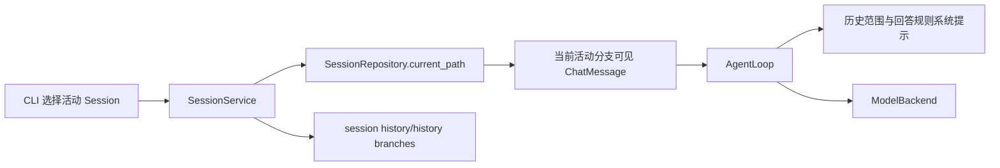

# Session 记忆上下文与历史问答防幻觉计划

> 角色：Planner
>
> 更新日期：2026-08-20
>
> 状态：READY_FOR_IMPLEMENTATION
>
> 关联计划：[`SESSION_TREE_GIT_IMPLEMENTATION_PLAN.md`](./SESSION_TREE_GIT_IMPLEMENTATION_PLAN.md)

## 目标与非目标

### 目标

本计划处理一个已经被实际 CLI 输出暴露的问题：Session 消息已经持久化，当前活动
分支也已经被组装进模型请求，但模型仍可能回答“没有之前的对话记录”。本轮目标是：

1. 明确区分“已存储的当前活动分支历史”和“模型尚未获得的其他 Session/旧分支”。
2. 让模型知道前置 `user`/`assistant` 消息就是当前 Session 的持久化可见历史。
3. 对“之前的对话”这类历史问题建立可验证的上下文边界和回答规则。
4. 增加跨进程、连续问答和分支隔离回归测试，证明历史确实进入模型输入。
5. 保留现有 Session、Task、审计和四工具安全边界。

### 非目标

- 不把隐藏推理、system prompt、tool 消息或完整内部轨迹写入可见 Session。
- 不把所有 Session 和所有历史分支默认拼接进每次模型上下文。
- 不通过 Bash 读取 SQLite、偏好文件或工作区文件来代替 Session 查询。
- 不引入向量检索、摘要压缩、长期记忆或后台记忆 Worker。
- 不保证模型在任意含糊问题下都能推断用户真正想查询的历史范围。
- 不在本轮修改权限模式、数据库迁移、Git 版本关联或消息树数据结构。

## 诊断结论与证据

### 当前链路已经具备的能力

当前实际工作树和运行数据证明，基础存储链路不是故障点：

- `SessionService.ask()` 会在执行 Task 前通过仓储读取活动叶子到根的路径，转换为可见
  `ChatMessage`，再传入 `AgentLoop.run(context_messages=...)`。
- `AgentLoop.run()` 会按 `system -> 已有历史 -> 本次 user 请求` 的顺序组装模型消息。
- `OpenAICompatibleBackend` 会把完整消息序列放入 Chat Completions 请求的 `messages` 字段。
- 当前本机活动 Session `886808de997447e2a9361e49c8368bc6` 存在 6 条可见消息，角色顺序为
  `user、assistant、user、assistant、user、assistant`，活动叶子指向最后一条 assistant 消息。
- 第三次提问的模型回答能够复述前两次问答，这反向证明历史消息已经进入模型上下文；
  第二次回答“没有之前记录”属于语义判断错误，不是数据库为空。

### 当前缺口

1. 系统提示只说明工具和审查模式，没有声明前置消息的来源、范围和可信语义。
2. 上下文没有显式标注 `Session`、活动分支和“无历史/有历史”的范围。
3. 模型只能看到当前活动分支，无法直接查询其他 Session、被切出的兄弟分支或完整历史树。
4. 测试验证了 SessionService 的分支上下文，但没有覆盖“新进程读取同一数据库后再次自然语言
   提问”的完整 CLI/Backend 消费链路。
5. “我之前都进行什么对话”可能指当前活动分支、整个当前 Session、其他 Session 或已切出
   的旧分支；当前系统没有把这些范围差异告知模型。

## 架构边界



边界原则：

- `SessionRepository` 只负责读取合法消息路径，不解释模型应如何回答。
- `SessionService` 负责确定本次任务的历史范围，并把可见历史交给编排层。
- `AgentLoop` 负责把历史范围以安全、明确的系统约束传给模型，不直接访问 SQLite。
- CLI 的 `session history` 和 `session branches` 是精确历史查询出口；模型自然语言回答不能
  被当作数据库查询结果的唯一证明。
- 如果未来要查询其他 Session 或旧分支，应增加显式只读能力边界，由 Runtime 注入查询服务；
  Tool 不得自行打开数据库或扫描应用数据目录。

## 功能契约

### 1. 当前活动分支上下文

#### 必须满足

- 每次普通问答仍只向模型注入当前活动分支从根到活动叶子的可见 `user`/`assistant` 消息。
- 本次新 user 请求只能追加一次，不能与预先读取的历史重复。
- 空 Session 必须明确表示当前活动分支没有历史，而不是让模型猜测是否存在其他会话。
- 历史消息保留原始角色，不得把 assistant 历史拼成 system 指令或把多条消息压成无边界长文本。
- 活动分支切换后，模型只能看到新活动路径；兄弟分支和其他 Session 不得泄漏。

#### 建议实现

- 在 system prompt 中增加结构化的上下文范围声明，例如：`Session=<脱敏稳定标识>`、
  `scope=current_active_branch`、`history_count=N`。
- 在历史 user/assistant 消息前后增加模型可识别的固定边界说明，但继续使用独立消息角色，
  不改变供应商协议的角色语义。

### 2. 历史问题回答规则

#### 必须满足

- 当用户询问“之前的对话”“刚才讨论了什么”“当前会话记录”等内容时，模型必须优先依据
  已注入的当前活动分支历史回答，不能笼统声称“没有历史记录”。
- 模型只能声称当前活动分支范围内的事实；如果用户要求其他 Session、已切出的旧分支或完整
  会话树，必须明确说明当前上下文范围，并指向精确的 Session 查询入口。
- 模型不得把“未注入其他 Session”表述成“系统没有任何历史”，也不得通过 Bash 搜索工作区
  文件来伪造会话记录。
- 历史上下文为空时，回答必须区分“当前活动分支暂无可见消息”和“系统没有历史数据”。

#### 示例

以下是语义示例，不锁定具体措辞：

```text
当前活动会话中已有 2 轮可见对话：
1. 用户：当前工程是什么审查模式？
   助手：full-access（完全访问）……
2. 用户：我之前都进行什么对话？
   助手：……
```

如果用户要求查看其他会话：

```text
我当前只获得 Session <id> 的活动分支上下文；要查看其他会话，请使用
`likai-nexus session list` 或 `likai-nexus session history <session-id>`。
```

### 3. 精确历史查询能力

#### 必须满足

- 现有 `session history <session-id>`、`session branches <session-id>` 继续作为不经过模型
  推断的精确查询接口。
- 历史 CLI 输出必须保持可见消息、稳定 ID、Task 状态和已有版本边界提示，不输出隐藏消息。
- 本轮不强制新增第五个工具；若产品要求自然语言查询其他 Session，必须另立计划定义只读
  查询契约、权限边界、结果预算和跨 Session 审计。

## 安全底线

- 历史上下文只能来自当前允许的 Session 路径，不能因为 full-access 而扩大到应用数据库、
  其他用户目录或其他 Session。
- system prompt 中只放稳定标识、范围和计数，不放 API Key、Token、Cookie、密码或数据库路径。
- 用户历史正文作为普通可见消息传入，不得提升为 system 指令；历史中的恶意文本不能改变工具
  安全、审批、审计或 Session 范围。
- 不为排查幻觉而把 SQLite 原文、内部审计、隐藏推理或完整工具输出注入模型。
- 任何无法读取历史的故障都必须产生具体、脱敏的错误；不能把读取失败伪装成“没有历史”。
- `session history` 读取失败、跨 Session 查询和无效 Message 必须沿用现有拒绝与审计语义。

## 非强制实施建议

以下是基于当前代码的非强制影响面估计，Implementer 可以合并、拆分或重命名实现：

- `orchestrator`：扩充系统提示模板，明确历史来源、范围、空历史和历史问答规则。
- `memory/session`：继续作为唯一活动路径解析入口，不把历史查询逻辑复制到 CLI 或 Tool。
- `events/CLI`：可在任务开始事件中显示 Session ID 和历史条数，但不显示完整历史正文。
- `tests`：增加 Recording/Fake Backend，直接断言实际发送的消息序列和 system 范围声明。
- `storage`：本轮不新增表；只复用已有 Session/Message 数据。

不建议本轮引入通用记忆抽象、向量库、自动摘要器、数据库 Tool 或模型自我反思循环。

## 验收与交接

### 验收契约

Implementer 必须用自动化测试或可重复集成验证覆盖：

1. 同一 Session 连续两次问答时，第二次模型请求包含第一次的 user 和 assistant 消息，且当前
   user 只出现一次。
2. 重新创建 Runtime/Backend 进程后，从同一 `data/` 数据库读取的历史仍进入下一次模型请求。
3. 空 Session、单轮 Session 和多轮 Session 的历史范围声明正确。
4. 从历史节点继续后，模型只收到选定路径，兄弟分支和其他 Session 不出现。
5. 历史问题测试不会得到“系统没有历史”这类与已注入消息矛盾的默认回答；模型被要求基于
   当前活动分支回答，并在超出范围时明确说明范围。
6. `session history` 输出与模型上下文范围一致，且仍隐藏 system/tool/内部审计内容。
7. 历史消息中的凭据哨兵、终端控制字符和提示注入文本不会进入 system prompt 或突破工具安全。
8. `--no-progress`、full-access、Task 状态、审计和 Git 版本关联行为不回退。

### 验证建议

涉及 AgentLoop、SessionService 和模型输入契约，完成后至少运行：

```powershell
.\.venv\Scripts\python.exe -m pytest tests/unit/test_session_tree_and_git.py tests/integration/test_session_cli.py -q -rs
.\.venv\Scripts\python.exe -m pytest -q -rs
.\.venv\Scripts\ruff.exe check .
.\.venv\Scripts\python.exe -m compileall -q src
git diff --check
```

### 交接要求

- Implementer 在 `docs/Implement/IMPLEMENTATION_NOTES.md` 记录实际上下文标记格式、历史范围
  语义、跨进程测试结果和相对本计划的偏差。
- Reviewer 重点检查：历史是否真的进入 Backend 请求、活动分支隔离、空历史语义、历史正文
  是否被错误提升为 system 指令，以及是否存在通过 Bash/数据库读取绕过 Session 边界的路径。
- 如果实现只能保证当前活动分支，必须在 CLI 和模型提示中明确这一范围；不得宣称支持“所有
  历史会话”或“完整会话树”。

## 反锚定检查

- 本计划锁定的是历史上下文语义、范围、安全底线和验收结果，不强制系统提示的具体文本、
  类名、文件名或新增工具名称。
- 现有 Session 树、数据库表和四工具执行链可以保持不变。
- 只有当用户明确要求自然语言查询其他 Session 或旧分支时，才需要另行决定是否新增只读查询
  Tool；本计划不提前扩展权限面。
- 计划不把一次模型回答的错误内容直接当作存储故障，而要求用 Backend 输入断言和端到端验证
  区分“历史未注入”和“模型语义幻觉”。
