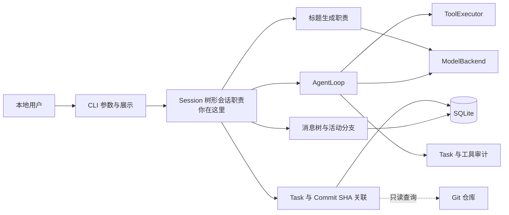

# Session 树形会话与 Git Commit 关联实施计划

> 角色：Planner
>
> 更新日期：2026-08-19
>
> 状态：READY_FOR_IMPLEMENTATION

## 目标与非目标

### 目标

本计划在 Session 持久化基础上增加“从历史节点继续”的分支能力，并把可用代码版本的 Git Commit SHA 与 Task 关联。Git 能力只负责记录和查询版本标识，不负责执行工程回滚。

1. 必须完成 Session、可见消息持久化和树形对话分支。
2. 用户可以新建、查看、切换、继续和删除会话。
3. 用户选择历史消息后，可以从该节点继续提问；旧分支必须保留，不得被覆盖或删除。
4. 模型继续对话时，只接收当前选中分支从根到活动叶子的可见消息。
5. 首个成功问答完成后，额外调用模型生成简短标题；标题失败不得影响原 Task。
6. 对已经存在可用 Commit 的代码 Task，记录该 Task 对应的完整 Git Commit SHA。
7. 用户可以通过历史 assistant Message 查询关联 Task 的 Commit SHA，再自行使用 Git 完成工程恢复。
8. 消息、Task、Commit SHA 和执行审计必须保持可追踪关系，查询版本不能改写原 Task 状态。

这里的“会话回滚”表示从旧消息创建新分支；“工程回滚”完全由用户在系统外手动完成。系统只提供 Commit SHA，不承诺恢复任何文件或副作用。

配套功能图见 [`SVG`](./SESSION_MVP_USE_CASE.svg) 和 [`PNG 预览`](./SESSION_MVP_USE_CASE.png)。

### 非目标

- 不实现 Token 预算、历史裁剪、摘要压缩、检索增强或长期记忆注入。
- 不保存 system prompt、隐藏推理、模型中间轮次、原始 Tool 参数或完整 Tool 结果。
- 不实现完整的图形化消息树编辑器、分支合并、分支重命名或分支级删除。
- 不创建 Git Commit，不自动暂存、储藏或清理未提交修改。
- 不执行 checkout、switch、reset、branch、Worktree、merge、rebase、push 或任何自动工程回滚。
- 不承诺 Commit SHA 能覆盖未提交文件、Git 忽略文件、仓库外文件、数据库写入、网络请求、软件安装或服务变更。
- 不实现后台标题 Worker、任务队列、多任务并发或模型调用优先级调度。
- 不实现会话搜索、归档、多用户归属、远程渠道同步或中断 Task 恢复。
- 不改变既有工具安全、审批、取消、审计和 Task 状态语义。

## 架构边界



### 必须保持的职责边界

- Channel/CLI 只负责参数解析、入口校验和结果展示，不直接操作 Session SQL 或执行 Git 命令。
- Session 职责负责会话、消息树、活动叶子、分支选择和一次会话问答的持久化顺序。
- Storage 负责外键、参数化查询、递归路径查询和事务，不决定模型上下文内容。
- AgentLoop 继续负责一个 Task 的模型与 Tool 循环；它接收已准备好的当前分支历史，不自行选择 Session。
- 标题生成必须复用可替换的 Model Backend，不能在 Session 层直接调用供应商协议。
- Git 版本关联职责只读取现有仓库状态并保存 Commit SHA，不创建提交，也不执行任何 Git 写操作。
- Safety 必须在工具执行之前完成检查与审批；版本查询不能成为绕过现有执行安全的入口。
- Task、ToolCall 和 Approval 保留执行事实；Session 与 Commit 关联不能取代或改写它们。

### 核心概念与关系

| 概念 | 必须表达的含义 | 不承担的职责 |
|---|---|---|
| Session | 一组可切换的树形可见对话，并记录当前活动叶子 | 不表示一次执行任务 |
| Message | user 或 assistant 可见消息，可指向同会话父消息 | 不保存内部工具轨迹 |
| Task | 一次用户请求的实际执行实例 | 不充当完整聊天历史 |
| Context Branch | 从历史节点产生的新消息路径 | 不删除原分支 |
| Commit Association | Task 完成后对应的一个完整 Git Commit SHA | 不执行 Git 恢复，也不覆盖未提交内容 |

推荐的概念数据关系如下；字段名和表拆分属于示例，Implementer 可以按现有存储风格调整：

```text
Session 1 ─── N Message
Message 0..1 ─── N child Message
Session ─── active Message leaf
Message 0..1 ─── Task
Task 0..1 ─── Commit Association
```

Git Commit 关联是 Session 的附加查询能力。普通对话、非 Git Task 或没有可用 Commit 的 Task 仍可正常使用树形 Session，只是不展示版本哈希。

## 功能契约

### 1. 会话与消息树持久化

#### 必须满足

- Session 必须具有稳定的唯一标识、标题、创建时间、最近消息时间和当前活动叶子引用。
- Message 必须具有唯一标识、所属 Session、角色、正文、父消息引用和创建时间。
- 首条 Message 的父消息为空；后续 Message 必须指向同一 Session 内的父消息。
- 必须拒绝跨 Session 父子关系，以及指向其他 Session 的活动叶子。
- 同一父节点可以拥有多个子节点；旧子树必须在创建新分支后继续存在。
- user 与 assistant Message 必须严格表达用户可见内容，不保存 system、tool 或内部中间消息。
- assistant 最终消息应关联产生它的 Task，以支持审计和 Git 检查点定位。
- 同一路径内必须具有稳定顺序；相同时间戳不能造成读取顺序不确定。
- 旧版线性会话数据必须有明确迁移或兼容策略，迁移后原顺序和内容不得丢失。

#### 建议实现

- 使用自引用父键表达消息树，并在 Session 上保存活动叶子，以避免每次推断当前分支。
- 使用数据库约束加应用层校验共同保证父消息与活动叶子的 Session 归属。

### 2. 正常问答与活动路径

#### 必须满足

一次正常提问按以下可观察顺序完成：

1. 校验 Session 和活动叶子，读取根节点到活动叶子的当前路径。
2. 把新 user Message 作为活动叶子的子节点持久化；空会话中的 user Message 为根节点。
3. 仅以当前路径和本次问题构造模型输入，本次问题不得重复加入。
4. 创建并运行原有 Task；工具调用继续遵守既有审批和审计流程。
5. Task 成功产生最终回答后，保存 assistant Message，并关联 Task。
6. 把新 assistant Message 设置为 Session 活动叶子。
7. 若这是首个成功问答且标题仍为默认值，再执行一次标题生成。

Task 失败或取消时，不得伪造 assistant 最终消息；已保存的 user Message 必须保留并清晰呈现其执行状态或可重试关系。

### 3. 从历史节点继续与分支切换

#### 必须满足

- 用户必须可以选择当前 Session 中任意合法的可见 Message 执行“回到这里继续”。
- 该操作只更新活动叶子，不删除目标节点之后的旧消息。
- 下一条 user Message 必须成为所选节点的新子节点，从而形成新分支。
- 查看当前对话历史时，必须从活动叶子沿父链回溯到根并反转展示。
- 用户必须可以查看分支点和可选叶子，并将活动叶子切换到已有分支。
- 给模型的上下文必须只包含当前活动路径，不能混入兄弟分支消息。
- 切换活动分支本身不创建 Task，也不更改历史 Task 的成功、失败或取消状态。
- 无效 Message、跨 Session Message 或已经删除的 Message 必须被拒绝，且不能改变活动叶子。

#### 建议实现

- 默认历史视图展示当前路径，额外的分支视图只展示分支点、叶子摘要和稳定标识，避免一开始实现复杂树形 UI。

### 4. Git Commit SHA 记录与查询

#### 必须满足

- 每个具备版本关联资格的 Task 最多记录一个完整 `commit_sha`，表示该 Task 对应的结果版本。
- Commit 记录必须关联 Task，并能通过 assistant Message 追溯；不得把哈希直接复制到 Message 正文中充当关联关系。
- 只有 Task 完成后已经存在、可读取且能够代表目标工程状态的 Commit 才能记录。
- 系统不得为了生成 Commit SHA 自动执行 add、commit、stash 或其他修改仓库状态的命令。
- Task 结束时若仍有未提交变更，必须把版本关联标记为不可用，不能把当前 `HEAD` 错误描述成 Task 结果版本。
- 用户查询历史 assistant Message 时，系统必须返回关联的 Task 和 Commit SHA；没有关联时明确返回“未记录版本”。
- 系统只展示或复制 Commit SHA，不执行任何恢复命令，也不验证用户后续手动恢复的结果。
- 如果系统只操作一个固定仓库，可以只保存 Task 关联和 Commit SHA；支持多个仓库时必须同时保存可区分的仓库标识。
- Commit 读取或保存失败不得影响原 Task、Message 或会话分支的既有结果。

#### 建议实现

- 第一版记录可以只包含记录标识、Task 外键、一个完整 Commit SHA 和创建时间；仓库标识按是否支持多仓库决定。
- 使用现有 Git 只读能力获取和校验 SHA，不为这项能力引入通用版本控制抽象。

### 5. 标题生成

#### 必须满足

- 标题只在首个成功问答保存后生成一次，输入限于首轮 user 与 assistant 可见内容。
- 标题调用与原 Task 串行隔离：先完成 Task 和回答保存，再调用 Backend 生成标题。
- 标题失败、超时或返回空值时保留默认标题，不得把已成功 Task 改为失败，也不得删除回答。
- 从历史创建分支不得自动重写标题。
- 必须保留未来改为后台任务的调用边界，但本期不引入队列或并发调度。

### 6. 会话管理与删除

#### 必须满足

- 用户必须可以新建会话、列出会话、查看当前分支历史、查看分支、切换会话和继续提问。
- 会话列表至少展示稳定标识、标题和最近消息时间，并有确定性排序。
- 删除必须要求明确的目标 Session 标识和二次确认；取消确认时不得写数据库。
- 确认删除后，Session 和整个 Message 子树必须在单一事务内删除，不得留下孤儿消息。
- 删除 Session 不得删除或改写 Task、ToolCall、Approval、Commit 关联和审计记录。

#### 示例

以下仅说明交互能力，不强制具体命令名：

```text
session new
session list
session history <session-id>
session branches <session-id>
session continue-from <message-id>
session commit <message-id>
session switch <session-id>
session delete <session-id>
```

面向用户的结果建议同时展示 Session、Message、Task 的稳定标识，以及目标消息是否记录了 Commit SHA。

## 安全底线

- 必须沿用既有“默认只读、写入与执行需审批”策略；Session 不能绕过 Safety 或 Executor。
- Git 版本关联只允许执行读取 Commit 和工作区状态所需的只读检查；不得执行任何会改变索引、工作树、本地引用或远端的 Git 命令。
- 必须保存完整 Commit SHA，不能只存可能冲突的缩写哈希。
- 多仓库场景中的仓库标识必须规范化并限制在允许工作区内，不能借查询版本访问范围外路径。
- 日志和报错不得包含密钥、Token、Cookie、密码、远端凭据或完整敏感提示内容。
- 必须明确告知用户 Commit SHA 只代表已提交内容，不能代表未提交文件、数据库、网络、系统或外部服务副作用已经撤销。
- 原 Task 和工具审计必须不可变；用户手动恢复工程也不能把旧 Task 改回未执行。
- Session 删除后仍需通过 Task 与 Commit 关联回答“执行过什么”，但普通会话接口不得泄露内部敏感数据。

## 非强制实施建议

### 职责拆分

- memory/session：领域操作、活动路径解析、分支选择和会话生命周期。
- storage：消息自引用关系、递归路径查询、事务和 Task/Commit SHA 关联持久化。
- orchestrator：接收当前分支历史并运行一个新 Task，返回最终可见回答与 Task 标识。
- Git 只读职责：按需读取当前 Commit 和工作区状态，不包含任何写操作。
- CLI/channel：提供最小命令和清晰提示，不承载领域规则。

以上是职责级影响面估计，不强制文件名、类名、函数名或表拆分。Implementer 可以按现有代码采用更小的实现形态，并在实施说明中记录重要偏差。

### 推荐实施顺序

1. 增加 Session 与树形 Message 存储、迁移和活动路径查询。
2. 接通新建、列表、历史、切换、分支、删除、正常问答和标题生成。
3. 增加 Task/Commit SHA 关联、查询入口和“未记录版本”状态。
4. 最后补齐 CLI 展示、失败恢复、审计关联和端到端测试。

不建议本期提前引入通用版本控制抽象、外部副作用补偿引擎、事件溯源平台或后台调度系统。

## 验收与交接

### 验收契约

Implementer 必须用自动化测试或可重复集成验证覆盖：

- 新建、重启后读取、列表排序、会话切换和删除确认/取消。
- 消息父子关系、同 Session 约束、活动叶子归属和旧线性数据迁移。
- 从历史节点继续后旧分支完整保留，当前历史只包含所选路径，并可切回旧分支。
- 模型输入只含当前活动路径，本次 user 消息不重复，兄弟分支不泄漏。
- Task 失败、模型失败、标题失败时，Message、Session 与 Task 状态符合本计划。
- 标题只在首个成功问答后生成一次，分支操作不触发重命名。
- 删除整个消息树但保留 Task、工具、审批、Commit 关联与审计。
- 具备有效结果 Commit 的 Task 只记录一个完整 SHA，并能通过 assistant Message 查询。
- Task 存在未提交结果、不是 Git Task 或没有可用 Commit 时不记录误导性 SHA，并明确显示“未记录版本”。
- 多仓库模式下，相同 SHA 的记录仍能区分仓库；单仓库模式不强制冗余仓库字段。
- Git 读取失败不伪造版本、不删除消息分支、不改写旧 Task，错误信息包含可定位的失败步骤且不泄密。
- 自动化测试能够证明版本关联流程没有执行 add、commit、stash、checkout、switch、reset、branch、Worktree、merge 或 push。
- 非 Git 副作用不会被界面或日志错误描述为已撤销。
- system、tool、隐藏推理和敏感内容不会写入可见 Message 或 Git 元数据。

### 验证建议

代码完成后，按项目实际配置至少运行：

```bash
pytest
ruff check .
python -m compileall src
```

Git 集成测试建议使用临时目录创建本地仓库，不依赖用户真实仓库，不访问远端，并验证索引、工作树和引用在测试前后保持不变。

### 交接要求

- Implementer 必须在 `docs/Implement/IMPLEMENTATION_NOTES.md` 记录实际职责落点、迁移策略、Git 只读命令边界、验证结果和相对本计划的偏差。
- Reviewer 必须重点检查消息跨 Session 约束、分支上下文隔离、删除事务、完整 SHA、Git 零写入和审计不可变性。
- 若现有 Task 无法可靠确定一个代表结果的 Commit，应保留 Session 功能并返回“未记录版本”，不得自动创建 Commit 进行弥补。

### 反锚定检查

- 本计划锁定的是用户行为、数据关系、安全底线和验收结果，不强制内部文件结构。
- 除跨模块持久化关系外，字段名、类名、方法名、命令名和表拆分均可按现有工程调整。
- 即使 Implementer 合并、拆分或重命名模块，只要上述行为、安全和测试契约成立，本计划仍然有效。
- Git 关联只是版本元数据；即使更换内部存储形态，也不得扩展成自动 Git 回滚工程。
