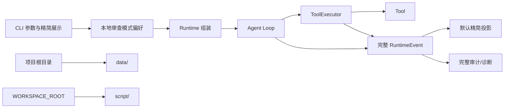

# CLI 易用性、目录与持久化模式优化计划

## 目标与非目标

### 目标

本轮解决四个已经影响实际使用的问题：

1. 本地用户首次确认进入 `full-access` 后，将其保存为默认模式；后续任务不再重复确认。
2. CLI 默认只展示任务与工具调用的大体过程，不再打印模型轮次、安全检查开始/通过等内部细节。
3. 在配置的工作区内自动建立 `script/`，作为智能体生成和执行脚本的默认存放位置。
4. 应用数据统一放到项目根目录的 `data/`，不再默认放进 `workspace/`。

本文中的“项目根目录”指 CLI 启动时用于读取 `.env` 的目录。当前工程中即：

```text
D:\Desktop\Code\Lak-Nexus
```

目标布局：

```text
Lak-Nexus/
├─ .env
├─ data/
│  ├─ likai_nexus.db
│  └─ 本地偏好数据
└─ workspace/
   └─ script/
```

配套交互图见 [`SVG`](./USABILITY_PERSISTENT_ACCESS_USE_CASE.svg) 和
[`PNG`](./USABILITY_PERSISTENT_ACCESS_USE_CASE.png)。

偏好数据的具体文件名或表名不属于公共契约；Implementer 可以选择 SQLite 设置表或原子写入的
本地偏好文件，只要行为、迁移和故障降级满足本文要求。

### 非目标

- 不改变 `channels -> orchestrator -> executor -> tools` 主执行链。
- 不重写 Tool、ModelBackend、审计或三档权限体系。
- 不把所有 Bash 命令都强制转换成脚本文件。
- 不把 Bash 当前工作目录改成 `workspace/script/`；项目类命令仍应从工作区根执行。
- 不允许远程渠道静默开启本机持久化的 `full-access`。
- 不在本轮引入账户系统、多用户权限或云端偏好同步。

## 架构边界



边界原则：

- 持久化默认模式由本地入口选择，Agent Loop 只接收本次已经确定的有效模式。
- 事件生产仍保持完整；CLI 展示层决定哪些事件对普通用户可见。
- 目录解析由配置/运行时初始化统一完成，Tool 不自行推断项目根目录。
- `data/` 与 `workspace/` 是同级目录，不能再通过相对路径解析把数据库放回工作区。

## 功能契约

### 1. full-access 改为首次确认后持久化

#### 必须满足

- `--review-mode` 未传入时，CLI 使用本机最近一次明确选择并成功保存的审查模式。
- 本机没有已保存模式时，默认仍为 `strict`。
- 用户第一次明确选择 `full-access` 时，继续显示一次 `FULL-ACCESS` 强确认。
- 强确认通过后，`full-access` 成为本机默认模式；本次任务和之后未显式选模式的任务均使用它。
- 已保存的默认模式已经是 `full-access` 时，不再对每个任务重复强确认。
- 强确认拒绝、输入中断或保存失败时，不得进入 `full-access`，也不得创建或调用模型执行该任务。
- 用户明确选择 `strict` 或 `relaxed` 后，应立即替换本机默认模式；以后启动不再默认 full-access。
- 模式偏好损坏、无法解析或包含未知值时必须安全降级到 `strict`，并给出简短可定位提示。
- 审计中必须能够区分“首次人工确认”与“沿用本地已确认默认值”，但不得重复生成伪造的人工审批记录。

建议使用以下优先级解析有效模式：

```text
本次显式 --review-mode > 已保存本机默认值 > strict
```

显式选择的含义是更新本机默认值，而不是一次性覆盖。这样用户可以用同一个入口进入或退出
持久化 full-access，不需要再增加一套配置命令。

#### 安全语义

- “不再重复确认”只取消任务级重复交互，不改变 full-access 的能力范围。
- full-access 仍等价于当前操作系统用户权限，不获得管理员权限。
- 超时、取消、输出限制、敏感信息脱敏和审计继续生效。
- 本地偏好只是易用性状态，不应保存密钥、Token、Cookie 或用户任务正文。
- 如果未来 full-access 的权限语义发生实质扩大，建议通过偏好版本升级触发一次重新确认；
  普通程序重启、任务切换或日期变化不得导致重复确认。

### 2. CLI 默认展示精简过程

#### 必须满足

CLI 默认只展示普通用户关心的过程：

- 任务开始及当前审查模式。
- 调用了哪个工具。
- 工具最终成功、失败、拒绝或取消。
- 失败时提供经过脱敏的简短原因。
- 最终任务结果继续使用现有结果出口展示。

默认不展示：

- 模型调用开始/结束和轮次细节。
- 安全检查开始/通过。
- 模式自动允许。
- 审批指纹、参数哈希和 metadata 压缩细节。
- 与最终 CLI 状态行完全重复的任务完成事件。

示例，不强制具体标点或颜色：

```text
[任务] 开始，模式：full-access
[工具] read：开始
[工具] read：成功（18ms）
[工具] bash：开始
[工具] bash：失败（退出码 1）
```

事件源仍应产生现有完整事件，审计仍保存必要的详细状态。精简只能发生在 CLI 展示投影，
不能通过删除安全检查或审计事件实现。

`--no-progress` 必须保持兼容并关闭全部过程行；人工审批提示不属于过程行，仍按权限规则出现。

#### 建议实现

- 为工具事件填充已脱敏的结构化字段，例如规范工具名、终态和耗时；CLI 不解析中文 message。
- 可增加显式详细模式供诊断时恢复全部事件，但它不是本轮核心验收条件。
- 未识别事件在默认精简展示中忽略，在详细模式或审计中保留。

### 3. workspace/script 默认脚本目录

#### 必须满足

- 运行时初始化时确保 `<WORKSPACE_ROOT>/script/` 存在，重复启动必须幂等。
- 目录名按用户要求使用单数 `script`，不擅自改成 `scripts`。
- 创建失败时，启动错误必须包含目标路径、操作和脱敏后的具体失败原因。
- 模型系统提示或 Bash 工具说明必须让模型知道：需要保存脚本时，默认写入 `script/`。
- Bash 的默认 `cwd` 仍是 `WORKSPACE_ROOT`，因此脚本可通过工作区相对路径引用。
- 该目录只是默认位置，不是新的权限边界；full-access 仍可按既有规则访问外部脚本。
- 普通单条 Bash 命令不要求先落盘；只有需要生成、复用或维护脚本时才使用该目录。

严格模式仍执行既有命令允许策略。若严格模式未来需要运行保存脚本，必须单独设计脚本审批和内容
冻结机制，不能因为新增目录就绕过当前命令策略。

### 4. 根目录 data/ 与数据库路径

#### 当前问题

`.env.example` 当前写的是：

```text
DATABASE_PATH=./data/likai_nexus.db
```

但 `Settings` 会把相对 `DATABASE_PATH` 拼接到 `WORKSPACE_ROOT`，实际结果是：

```text
<WORKSPACE_ROOT>/data/likai_nexus.db
```

这与用户期望的项目根目录 `data/` 不一致。

#### 必须满足

- 相对 `DATABASE_PATH` 必须相对于项目根目录解析，不再相对于 `WORKSPACE_ROOT`。
- 未配置 `DATABASE_PATH` 时，默认数据库位置为 `<项目根>/data/likai_nexus.db`。
- `data/` 在运行时自动创建；创建失败必须安全终止并报告具体目标和原因。
- 应用自身的数据库、模式偏好和未来运行状态默认统一位于 `data/`。
- `data/` 保持 Git 忽略；不得提交实际数据库或偏好数据。
- 显式绝对数据库路径可作为兼容配置保留，但如果它解析到工作区内部，应拒绝启动并说明冲突。
- 严格和宽松模式下，Tool 的工作区文件能力不能读取根目录 `data/`。
- full-access 仍保留其既有外部文件访问能力；应用不得主动把数据库内容送入模型上下文。

#### 旧数据迁移

必须识别至少两个旧位置：

```text
<WORKSPACE_ROOT>/data/likai_nexus.db
<WORKSPACE_ROOT>/.likai_nexus/tasks.db
```

迁移行为：

- 新位置不存在、只发现一个旧库时，自动安全迁移到根目录 `data/`。
- 迁移前后必须验证数据库可打开，不能用空库覆盖旧库。
- 旧库及可能存在的 SQLite sidecar 文件不得留在 workspace；迁移后移到根目录 `data/`
  下的备份位置，确认成功后再启用新库。
- 新旧位置同时存在时不得静默合并或覆盖；应选择明确的权威库并把另一份移到 data 下的
  可恢复备份位置，同时输出一次简短提示。
- 任一步失败时保留原数据，启动失败，不得半迁移后继续运行。

具体迁移函数、备份目录名和原子替换手段由 Implementer 按 SQLite 与 Windows 文件语义选择。

## 安全底线

- 持久化 full-access 是用户明确要求的本地行为，不能扩展到飞书、微信等远程入口。
- 偏好读取失败只能降级为 strict，不能猜测为 full-access。
- 首次 full-access 确认必须发生在模型调用和任务执行之前。
- 切换到 strict/relaxed 后，下一次启动不能继续沿用旧的 full-access。
- 精简 UI 不得减少审计内容、错误终态或安全检查。
- 数据迁移不得覆盖、删除或截断唯一一份旧数据库。
- `data/` 和 `script/` 的目录创建不得跟随不受信任的符号链接逃逸到意外位置。
- 错误、过程输出和迁移提示不得泄露密钥或数据库正文。

## 非强制实施建议

以下是基于当前代码的非强制影响面估计，不锁定文件名、类名或私有拆分方式：

- CLI/配置职责：区分“未显式传模式”和“显式选择模式”，加载并保存本地偏好，精简事件渲染。
- Runtime/安全职责：接收已经确定的有效模式，首次进入 full-access 时完成一次确认。
- 事件职责：为工具开始和终态提供稳定、安全的结构化展示字段。
- 存储/配置职责：解析项目根、创建 data、处理旧数据库迁移和本地偏好持久化。
- 工具/提示职责：声明 `workspace/script/` 是默认脚本目录，但不改变 Bash 工作目录。
- 测试职责：复用现有 Fake Backend、StaticApprovalHandler、临时目录和 CLI 集成测试模式。

Implementer 可以在满足行为契约和安全底线的前提下合并、拆分或调整位置，并在
`docs/Implement/IMPLEMENTATION_NOTES.md` 记录重要偏差。

不建议为了四个行为新增通用 DI 框架、全局事件总线或复杂配置中心。一个小型偏好存储边界、
CLI 事件投影和目录初始化职责已经足够。

## 验收与交接

### 自动化验收

必须覆盖：

1. 无偏好且未传模式时使用 strict。
2. 首次选择 full-access 只确认一次，确认后保存并执行。
3. 新进程/新 Runtime 沿用 full-access 时不再请求确认。
4. 首次确认拒绝、EOF、保存失败时不创建任务、不调用模型、不保存 full-access。
5. 显式选择 strict 或 relaxed 后替换默认值，后续不再沿用 full-access。
6. 偏好损坏或未知模式安全降级为 strict。
7. 默认过程输出只包含任务开始、工具名和工具终态，不含模型轮次、安全检查和自动允许。
8. 工具失败、拒绝和取消仍有简短可诊断结果；事件接收器故障仍不影响任务结果。
9. `--no-progress` 保持无过程输出。
10. 首次启动创建 `workspace/script/` 和根目录 `data/`，重复启动不报错。
11. Bash 仍以工作区为 cwd，模型可获知脚本默认目录。
12. 相对和默认数据库路径均落到根目录 data，不落到 workspace。
13. 两种旧数据库路径完成成功迁移；冲突和失败路径不丢数据。
14. strict/relaxed 不能借助新目录读取根目录 data；full-access 原有能力不回退。
15. 偏好、过程、错误和迁移日志不泄露敏感信息。

### 验证命令

实现涉及配置、CLI、安全模式、存储和跨模块接口，完成后必须运行：

```powershell
.\.venv\Scripts\python.exe -m pytest -q -rs
.\.venv\Scripts\ruff.exe check .
.\.venv\Scripts\python.exe -m compileall -q src
git diff --check
```

### 交接要求

- Implementer 在 `docs/Implement/IMPLEMENTATION_NOTES.md` 记录偏好存储选择、项目根解析规则、
  旧数据库迁移策略、实际测试结果和任何计划偏差。
- Reviewer 重点复核首次确认边界、偏好损坏降级、旧数据库不丢失、默认 UI 事件白名单和
  工作区/data 隔离，并在 `docs/Review/REVIEW.md` 给出结论。
- 用户手工验收时至少连续运行两次 full-access 任务，确认第一次提示、第二次无提示；随后切换
  strict 并重启，确认默认模式已经退出 full-access。

## 反锚定检查

- 本计划锁定行为、数据位置和安全边界，没有强制偏好文件名、设置表名或迁移类名。
- 预计影响范围只写到职责层；Implementer 仍可选择符合现有项目的最简代码形态。
- 详细事件继续保留，默认 UI 精简与内部可观测性没有被错误绑定。
- `script/` 是默认存放位置，不被误写成所有命令的强制执行目录。
- `data/` 的根目录语义、旧数据迁移和 full-access 持久化都有明确验收，不依赖具体目录重构。
